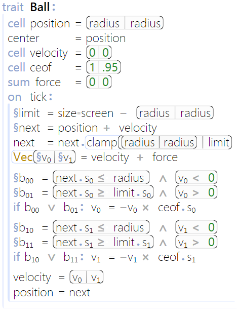
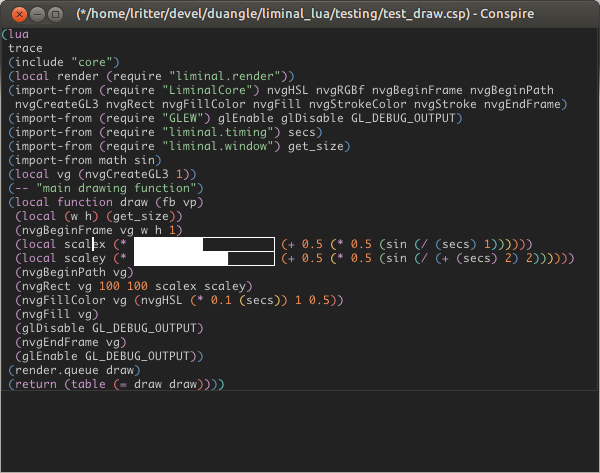
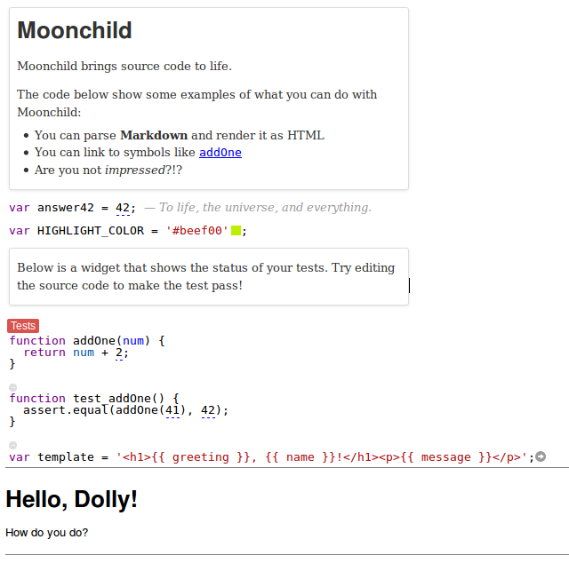
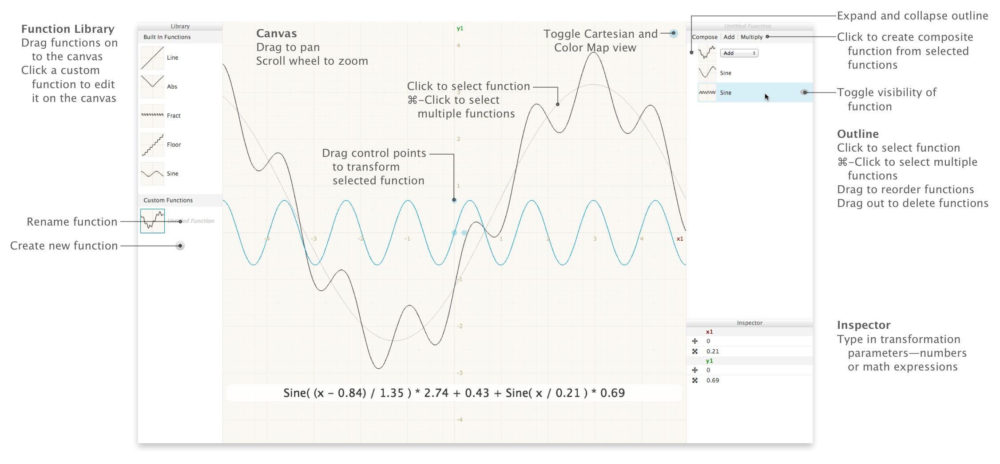

# A new wave of programming

This page is a collection of links of articles, demos, experiments and more all around the idea of new interfaces and editors to program in.

This list was compiled by Martijn Brekelmans, a Dutch computer engineering student who's getting more and more inspired by "what's out there". I've compiled this list to be as accurate and free of negative judgement as possible.

# Index of TLA's (Three Letter Abbreviations)

* **dsl** - a domain specific language.

> A domain-specific language is a computer language specialized to a particular application domain. This is in contrast to a general-purpose language, which is broadly applicable across domains, and lacks specialized features for a particular domain.

* **ast** - an abstract syntax tree. The underlying representation of any programming language.

> an abstract syntax tree, or just syntax tree, is a tree representation of the abstract syntactic structure of source code written in a programming language.

###### Quotes from Wikipedia

# Articles

## [Typography in code](http://research.microsoft.com/en-us/projects/liveprogramming/typography.aspx)
An article by Microsoft's research department, showcasing an editor made
specifically to greatly enhance the readability of programs
by means of typography.

-- Author: **Sean McDirmid**, Microsoft Research

## [Domain specific languages](http://spin.atomicobject.com/2015/05/19/domain-specific-vs-notation/)
An article about the difference between traditional domain specific languages and notation. It argues that traditional domain specific languages aren't actual dsl's. Examples of real domain specific languages are math, music and chess notation.

> emulating the English language—complete with nouns, verbs, and prepositions—is simply the language of the domain, not a truly domain-specific language. A truly domain-specific language is a new language designed for use in a particular domain, with a new vocabulary and grammar suited to the specific problem.

...

> A key difference between using the language of the domain and a domain-specific language is that a true DSL—notation—is not only suited for expressing problems and solutions, but also for getting from one to the other.

-- Author: **Eric Shull**

## [Why programming languages use only one "view" and how to fix that](http://westoncb.blogspot.nl/2015/06/why-programming-languages-dont-have.html)
An article taking a different look at programming interfaces, discussing the usage of text as the primary interface for programming.

> The more I think about 'program models,' the more our treatment of program source code seems bizarre. Why aren't the models of computer programs prior to their source code representations? Shouldn't program models be the basis for generating program views? Shouldn't we store models on disk and build views when using our programming tools? Shouldn't we pass models around the internet instead of views?

*On a side note, for people interested in building multiple views on top of code, I made a JavaScript library that synchronizes objects over multiple webpages, an array in your source code can be visualized as an unsorted list on your phone! [check it out here](https://github.com/Azeirah/Object.remote.git)*

-- Author: **Weston Beecroft**
# Demos

## [Conspire](http://blog.duangle.com/2015/01/conspire-programming-environment-for.html)

Conspire is an editor developed for an incredibly ambitious game by duangle game studios. Conspire is deceivingly simple and best defines the concept of "graphical macros". Similar in ideology and usability as Moonchild. Conspire, unlike most of the other editors shown here is based on a lisp

-- Author: [Leonard Ritter, Duangle](http://blog.duangle.com/)

## [Moonchild](https://github.com/cdglabs/moonchild.git)

Moonchild is an experimental editor which is able to replace parts of your source code with alternative graphical representations. A sliding number widget, rendering markdown in your source code, unit tests that run while you're writing functions, and more!

###### you can check out [my fork of Moonchild](https://github.com/azeirah/moonchild.git), which contains a live editing environment in the `live` branch. If you're interested in using this, you can contact me via email@martijnbrekelmans.com

> Moonchild brings source code to life. It's a toolkit for experimenting with new kinds of programming interfaces. It's based on CodeMirror, a web-based text editor. Moonchild adds a framework which makes it easy to create plugins which modify and extend the source code presentation.

[Demo video here](https://vimeo.com/106498564)

-- Author: **Patrick Dubroy**, [cdglabs](https://github.com/cdglabs)

## [Vogo](http://mgrf.de/vogo/)

> An experimental direct manipulation interface for Turtle Graphics.

Vogo adds a direct manipulation user interface to Turtle Graphics. This takes on an entirely new approach to programming. This is programming without even touching text.

-- Author: [Matthias Graf](http://mgrf.de)

## [Recursive Drawing](http://recursivedrawing.com/)

>  Recursive Drawing is an exploration of user interface ideas towards the development of a spatially-oriented programming environment.

-- Author: [Toby Schachman](http://tobyschachman.com)

## [Shadershop](http://tobyschachman.com/Shadershop/)

Shadershop is an editor for directly manipulating mathematical functions to aid in the process of designing of shaders. Shadershop is open source, and you can [try it right now inside your browser](http://www.cdglabs.org/Shadershop/)

-- Author: [Toby Schachman](http://tobyschachman.com)

## [Light table](http://lighttable.com/)

In a collection like this, Light Table cannot be forgotten. You are likely familiar with Light Table already.

Light table is one of the first non-experimental usable editors that tried to innovate in the area of programming editors. It comes with features like live-editing, showing your data flow through your program, inline evaluation and far more.

-- Authors: Chris Granger, based on amount of Github commits, Gabriel Horner and Jamie Brandon. This is a large open source project with a total of 56 contributors.

## Videos

## [Ken Perlin's student lecture](http://livestream.com/cdmschool/events/3167937/videos/55979749)

The first half of this talk is mainly about what inspired Ken Perlin to get into computer graphics. The second half of this talk is about the tool used in this talk. It's a tool inspired by blackboards and childrens' shows. Drawings made in this program will turn to life. Examples of drawings embedded in this editor are movies, diagrams, 3d objects, vases, birds, graphs, butterflies that follow any light source, sound, shaders and much much much more. It is intended to go open source at some point in the future.

## People, pages and organizations to watch

## [Terry Davis](http://terry.davis.usesthis.com/)

No, I'm not kidding when including Terry Davis. Terry Davis has some very legitimate ideas on how to improve the current state of programming. For those of you who don't know him, he's a controversial software developer. We won't go deeper into any controversies surrounding him or his project, templeOS.

Terry Davis is a dedicated software developer who has spent the last 12 years building his own operating system from scratch. This operating system, templeOS, is inspired by the Commodore 64.

Because templeOS has been built from scratch, Terry is not restrained by any constraints imposed by any other operating system out there. It's built around exploration and experimentation.

Terry Davis has a [blog](http://terry.davis.usesthis.com/) as well as a [youtube account](https://www.youtube.com/channel/UCCRt2MnEf78kj7aWylAskAQ/videos) on which he frequently posts videos about his operating system. [TempleOS's official site](http://www.templeos.org/)

To get started on his work, I recommend checking out this introductory article on TempleOS first.

[A constructive look at TempleOS](http://www.codersnotes.com/notes/a-constructive-look-at-templeos)

## [Chris Granger](http://www.chris-granger.com/)

Author of Light Table. He's now working on Eve, his next project. He has many ideas, blog posts and videos on innovating inside the area of programming.

## [Future programming workshop](http://www.future-programming.org/)

The future programming workshop is a ~~top-notch workshop for students who want to learn how to cook on a budget.~~ Workshop on the future of programming.

There are many interesting videos demos and talks available on their website.

I wish to go (or even speak) here some day!

## [Microsoft Research](http://research.microsoft.com/en-us/)

Microsoft has a large research department, spending lots of time and brainpower on all kinds of areas.  Here are a few articles to get you started.

* [Live programming](http://research.microsoft.com/en-us/projects/liveprogramming/)
* [Research site for Software development](http://research.microsoft.com/en-us/about/our-research/software-development.aspx)

## [Communication Design Labs](https://github.com/cdglabs)

The CDG labs, or communication design labs is a collection of highly intelligent and motivated people working together on a large collection of very interesting projects.

The previously mentioned Moonchild and Shadershop projects come from the CDG labs.

At the moment, [their website](http://cdglabs.org) doesn't have any content on the front page, but you can check out their github repository to get a feel for what they're working on.

## [Bret victor](http://worrydream.com)

Bret Victor has spread many ideas through the internet, touching on the topics of education, interface design, graphical programming languages, game design, art and more.

Whenever you're looking at future programming ideas, you'll find Bret Victor as a cited source.

Bret's site is a huge repository of very well researched ideas and experiments. Out of any people on this site, I recommend watching Bret Victor most.

Bret has published several inspiring talks, as well as a few high-quality essays. I recommend reading and watching them all.

Demos:

* [Inventing on principle](worrydream.com/InventingOnPrinciple) -
This talk in particular has been a huge inspiration to myself, as well as to many others. Light table for example, was based around the ideas of this talk. [A very early version of light table](https://www.youtube.com/watch?v=7XUWpze_A_s)
* [Stop drawing dead fish](worrydream.com/StopDrawingDeadFish)
* [Drawing dynamic visualizations](worrydream.com/DrawingDynamicVisualizationsTalk)
* [Media for thinking the unthinkable](worrydream.com/MediaForThinkingTheUnthinkable)

Talks:

* [The future of programming](worrydream.com/TheFutureOfProgramming)
* [Seeing spaces](worrydream.com/SeeingSpaces)
* [The humane representation of thought](worrydream.com/TheHumaneRepresentationOfThoughtTalk)

Essays:

* [Up and down the ladder of abstraction](http://worrydream.com/LadderOfAbstraction/)
* [Learnable programming](http://worrydream.com/#!/LearnableProgramming)

## Older related projects

It's paradoxical and ever so ironic how these old projects are a great source of inspiration for editors and interfaces right now. These projects are better implementations of software used today, only this software is at least twice as old as I am.

#### [The mother of all demos, 1968](https://www.youtube.com/watch?v=yJDv-zdhzMY)

Anyone reading this has probably already seen the mother of all demos. The mother of all demos is a presentation of Douglas Engelbart's vision turned to reality. It showcases multiple representations for a single type of data. The mother of all demos was way ahead of its time, and still ahead of today in some areas.

#### [MIT's Genesys, 1970](https://www.youtube.com/watch?v=GYIPKLxoTcQ).

#### [Sketchpad](https://www.youtube.com/watch?v=6orsmFndx_o)

[Alan Kay's commentary on sketchpad](https://www.youtube.com/watch?v=495nCzxM9PI)

Sketchpad was developed by Ivan Sutherland.

#### [Programming with on-line graphics](https://www.youtube.com/watch?v=NLyIYmPfCps)

By Bert Sutherland, Ivan's brother.

#### Smalltalk

Smalltalk is the programming language brought to you by Xerox Parc. I would love to include more about Smalltalk in this compilation, unfortunately, I know barely anything about it.
